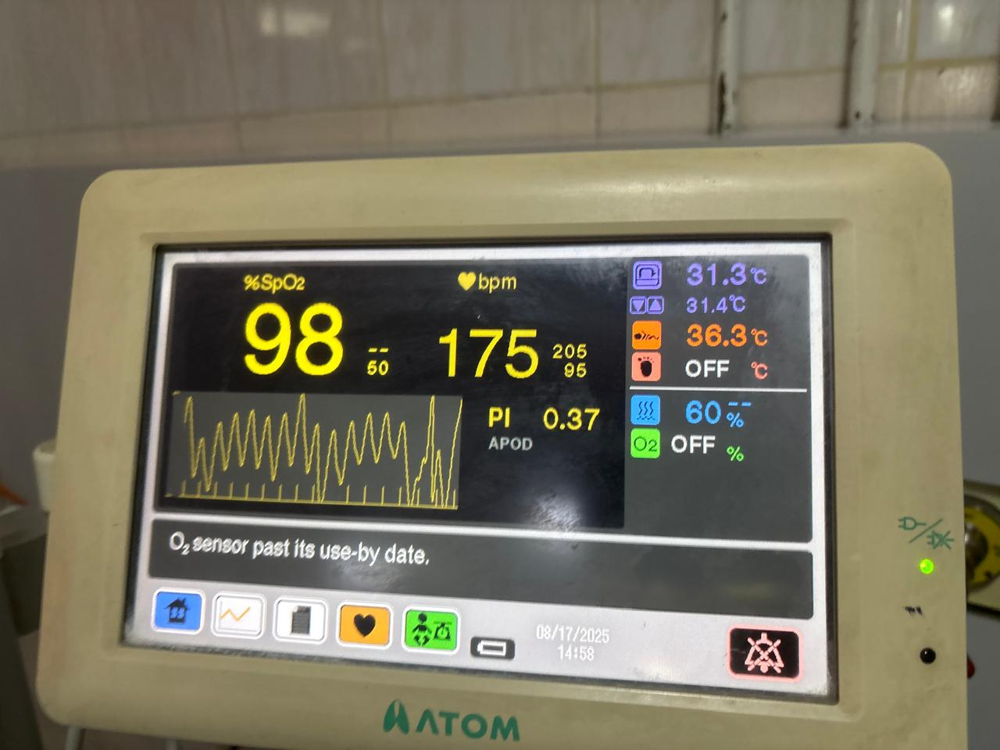
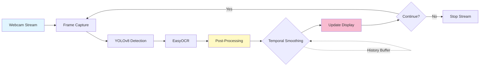

# Neonatal Incubator Display Reader

An automated system for detecting and reading neonatal incubator display values using **YOLOv8** for object detection and **EasyOCR** for optical character recognition. The system includes medical validation, post-processing, and live webcam support for real-time monitoring.
---

##  Features

### Core Capabilities

- **Automated Detection**: YOLOv8-based detection of incubator display components
- **OCR Integration**: EasyOCR for extracting numeric values from detected regions
- **Medical Validation**: Range checking for heart rate, SpO2, temperature, and humidity
- **Post-Processing**: Automatic decimal correction, integer enforcement, and confidence filtering
- **Live Monitoring**: Real-time webcam support with multiple camera selection
- **Temporal Smoothing**: Reduces flickering in live video feeds
- **Batch Processing**: Process entire directories of images
- **Interactive Dashboard**: Streamlit-based UI with telemetry logging
- **Annotation Workflow**: Label Studio integration for efficient dataset creation
- **Model Export**: ONNX support for deployment

### Detected Parameters




| Parameter            | Valid Range | Unit | Type              |
| -------------------- | ----------- | ---- | ----------------- |
| **Heart Rate**       | 60-220      | bpm  | Integer           |
| **Humidity**         | 30-95       | %    | Integer           |
| **Skin Temperature** | 32.0-39.0   | °C   | Decimal (1 place) |
| **SpO2**             | 70-100      | %    | Integer           |

---

## Project Structure

```
Neonatal_incubator_displayReader/
├── dataset/                          # Raw images of incubator displays
├── incubator_pipeline/              # Python package for detection & OCR
│   ├── __init__.py
│   ├── postprocessing.py            # Medical validation & corrections
│   └── ...
├── models/                           # Trained YOLO model files
│   └── incubator_yolov8n.pt
├── notebooks/
│   └── incubator_pipeline.ipynb     # Complete training & evaluation notebook
├── streamlit_app/                    # Streamlit dashboard for inference
│   ├── app.py                        # WebRTC webcam version
│   ├── app_opencv_webcam.py         # OpenCV webcam version (recommended)
│   ├── incubator_pipeline.py        # Core detection pipeline
│   └── requirements.txt
├── tests/                            # Unit tests for post-processing
│   └── test_postprocessing.py
├── artifacts/                        # Training outputs
│   ├── images/                       # Validation result images
│   ├── labels/                       # Converted YOLO labels
│   └── yolo/                         # YOLO training artifacts
├── ground_truth.json                # Label Studio annotations
├── requirements.txt                  # Python dependencies
└── README.md                         # This file
```

---

##  Installation

### Prerequisites

- Python 3.8+
- CUDA-compatible GPU (optional, for faster training)
- Webcam (optional, for live detection)

### Step 1: Clone Repository

```bash
git clone <repository-url>
cd Neonatal_incubator_displayReader
```

### Step 2: Create Virtual Environment (Recommended)

```bash
python -m venv venv
# Windows
venv\Scripts\activate
# Linux/Mac
source venv/bin/activate
```

### Step 3: Install Dependencies

```bash
pip install -r requirements.txt
```

### Step 4: Verify Installation

```bash
python -c "import torch; print(torch.cuda.is_available())"  # Check GPU
python -c "import easyocr; print('EasyOCR OK')"             # Check OCR
```

---

##  Quick Start

### Option 1: Use Pre-trained Model (Inference Only)

```bash
cd streamlit_app
streamlit run app_opencv_webcam.py
```

- Upload images or use live webcam
- View detected values with confidence scores
- Export telemetry data as CSV

### Option 2: Train Custom Model

1. **Annotate Dataset with Label Studio**

```bash
label-studio start
```

- Import images from `dataset/`
- Create bounding boxes for: `heart_rate_value`, `humidity_value`, `skin_temp_value`, `spo2_value`
- Export annotations to `ground_truth.json`

2. **Train YOLOv8 Model**

Open `notebooks/incubator_pipeline.ipynb` and run all cells to:

- Convert annotations to YOLO format
- Split dataset (80% train, 20% validation)
- Train YOLOv8n model
- Evaluate performance metrics
- Save best model to `models/incubator_yolov8n.pt`

3. **Run Inference**

```bash
cd streamlit_app
streamlit run app_opencv_webcam.py
```

### Option 3: Quick Integration (Single Image)

```python
from incubator_pipeline.postprocessing import PostProcessor, MedicalValidator

# Initialize
validator = MedicalValidator()
processor = PostProcessor(validator)

# Process single image
image_path = "path/to/incubator_display.jpg"
results = processor.process_frame(image_path, model, reader)

# Access validated values
print(f"Heart Rate: {results['heart_rate_value']['validated_value']} bpm")
print(f"SpO2: {results['spo2_value']['validated_value']}%")
```

---

## Pipeline Workflows

### Overall Training Workflow

```mermaid

```

### Inference & Post-Processing Workflow

```mermaid
flowchart TD
    Start([Input: Image/Video Frame]) --> A[Load YOLOv8 Model]
    A --> B[Run Object Detection]
    B --> C[Extract Bounding Boxes]
    C --> D[Crop Display Regions]
    D --> E[Run EasyOCR]
    E --> F[Parse OCR Results]

    F --> G{Medical Validator}

    G --> H[Check Heart Rate: 60-220 bpm]
    G --> I[Check Humidity: 30-95%]
    G --> J[Check Temperature: 32-39°C]
    G --> K[Check SpO2: 70-100%]

    H --> L{Valid?}
    I --> L
    J --> L
    K --> L

    L -->|Yes| M[Keep Original Value]
    L -->|No| N[Apply Corrections]

    N --> O[Decimal Shift Correction]
    O --> P[Integer Enforcement]
    P --> Q[Confidence Filtering]

    M --> R[Temporal Smoothing for Video]
    Q --> R

    R --> S[Final Validated Output]
    S --> T([Export: JSON/CSV/Display])

    style Start fill:#e1f5ff
    style G fill:#fff9c4
    style S fill:#c8e6c9
    style T fill:#f8bbd0
```

### Live Video Processing Workflow



---

## Training Pipeline

### Step 1: Data Annotation

Use **Label Studio** for efficient annotation:

```bash
label-studio start
```

**Annotation Guidelines:**

- Create rectangular bounding boxes around each display value
- Label classes: `heart_rate_value`, `humidity_value`, `skin_temp_value`, `spo2_value`
- Ensure boxes tightly fit the numeric display
- Export in JSON format to `ground_truth.json`

### Step 2: Data Conversion

Run the notebook cells to convert Label Studio annotations to YOLO format:

```python
# Converts ground_truth.json → artifacts/labels/*.txt
# Format: <class_id> <x_center> <y_center> <width> <height>
```

### Step 3: Dataset Split

```python
# 80% training, 20% validation
train_images = images[:split_index]
val_images = images[split_index:]
```

### Step 4: YOLOv8 Training

```python
from ultralytics import YOLO

model = YOLO('yolov8n.pt')  # Start with pre-trained weights
results = model.train(
    data='data.yaml',
    epochs=50,
    imgsz=640,
    batch=16,
    name='incubator_detection'
)
```

**Training Parameters:**

- **Epochs**: 50 (increase for more data)
- **Image Size**: 640x640
- **Batch Size**: 16 (adjust based on GPU memory)
- **Optimizer**: AdamW
- **Learning Rate**: Auto-adjusted

### Step 5: Model Evaluation

```python
# Validation metrics
metrics = model.val()
print(f"Precision: {metrics.box.p:.3f}")
print(f"Recall: {metrics.box.r:.3f}")
print(f"mAP@0.5: {metrics.box.map50:.3f}")
```

### Step 6: Export Model

```python
# Save for deployment
model.export(format='onnx')  # Optional: ONNX format
```

---

## 🔍 Inference & Detection

### Single Image Detection

```python
from ultralytics import YOLO

model = YOLO('models/incubator_yolov8n.pt')
results = model.predict(source='path/to/image.jpg', conf=0.25)

# Access detections
for box in results[0].boxes:
    class_id = int(box.cls[0])
    confidence = float(box.conf[0])
    bbox = box.xyxy[0].tolist()  # [x1, y1, x2, y2]
```

### Batch Processing

```python
results = model.predict(source='path/to/folder/', save=True, conf=0.25)
```

### Live Webcam Detection

```python
import cv2

cap = cv2.VideoCapture(0)
while True:
    ret, frame = cap.read()
    results = model.predict(source=frame, conf=0.25)
    annotated_frame = results[0].plot()
    cv2.imshow('Detection', annotated_frame)
    if cv2.waitKey(1) & 0xFF == ord('q'):
        break
```

---

## ✅ Post-Processing & Validation

### Medical Range Validation

```python
from incubator_pipeline.postprocessing import MedicalValidator

validator = MedicalValidator()

# Define valid ranges
MEDICAL_RANGES = {
    'heart_rate_value': (60, 220),      # bpm
    'humidity_value': (30, 95),         # %
    'skin_temp_value': (32.0, 39.0),    # °C
    'spo2_value': (70, 100)             # %
}

is_valid = validator.validate(value=85, parameter='heart_rate_value')
```

### Automatic Corrections

**1. Decimal Shift Correction**

```python
# Example: OCR reads "98.6" but should be "986" for heart rate
corrected = processor.decimal_correction(value=98.6, param='heart_rate_value')
# Output: 986
```

**2. Integer Enforcement**

```python
# Example: Humidity should be integer, not 45.7
corrected = processor.enforce_integer(value=45.7, param='humidity_value')
# Output: 46
```

**3. Confidence Filtering**

```python
# Discard low-confidence detections
if ocr_confidence < 0.5:
    result = None  # Ignore unreliable reading
```

### Temporal Smoothing (Live Video)

```python
from incubator_pipeline.postprocessing import TemporalSmoother

smoother = TemporalSmoother(window_size=5)

# Apply to video stream
for frame in video_stream:
    raw_value = detect_and_ocr(frame)
    smoothed_value = smoother.update(raw_value, parameter='heart_rate_value')
    display(smoothed_value)
```

**Benefits:**

- Reduces flickering in live feeds
- Handles transient OCR errors
- Configurable window size (default: 5 frames)

---

## 🎨 Streamlit Dashboard

### Features

- **Upload Images Tab**: Single or batch image processing
- **Live Webcam Tab**: Real-time detection with OpenCV
- **Batch Processing Tab**: Process entire directories
- **Telemetry Data Section**: View, filter, and export readings as CSV

### Running the Dashboard

```bash
cd streamlit_app
streamlit run app_opencv_webcam.py
```

**Configuration (Sidebar):**

- YOLO weights path: `../models/incubator_yolov8n.pt`
- Detection confidence: 0.25 (adjustable 0.1-0.9)

### Usage

1. **Upload Images**

   - Click "Browse files"
   - Select one or multiple images
   - View annotated results with bounding boxes and OCR values
   - Readings are automatically logged

2. **Live Webcam**

   - Select camera from dropdown (if multiple available)
   - Click "Start Webcam"
   - Position incubator display in frame
   - Click "Capture Frame" to save current readings
   - Click "Stop Webcam" when finished

3. **Batch Processing**

   - Enter directory path containing images
   - Click "Process directory"
   - Progress bar shows processing status
   - Results saved to output folder

4. **Telemetry Data**
   - View all captured readings in table format
   - Download data as CSV
   - View confidence score distributions
   - Clear all data when needed

---

## 📹 Live Webcam Support

### OpenCV Webcam (Recommended for Local Use)

**Installation:**

```bash
pip install opencv-python streamlit
```

**Running:**

```bash
cd streamlit_app
streamlit run app_opencv_webcam.py
```

**Features:**

- ✅ Works locally without WebRTC
- ✅ Simple start/stop webcam controls
- ✅ Real-time detection overlay
- ✅ Capture frames to save readings
- ✅ Live readings display

**Requirements:**

- Local webcam access
- Camera permissions enabled

### WebRTC Webcam (For Production Deployment)

**Installation:**

```bash
pip install streamlit-webrtc av
```

**Running:**

```bash
cd streamlit_app
streamlit run app.py
```

**Features:**

- ✅ Works in production with HTTPS
- ✅ Browser-based webcam streaming
- ✅ Better for deployed apps

**Requirements:**

- HTTPS connection (or localhost)
- May require STUN/TURN servers for remote access

### Troubleshooting Webcam Issues

**Webcam Not Working (OpenCV Version):**

1. Check camera permissions in system settings
2. Ensure no other app is using the camera
3. Try different camera index:
   ```python
   cap = cv2.VideoCapture(0)  # Try 1, 2, etc.
   ```

**Webcam Not Working (WebRTC Version):**

1. Ensure you're using HTTPS or localhost
2. Check browser camera permissions
3. Try a different browser (Chrome/Firefox recommended)

**Low Detection Accuracy:**

1. Adjust confidence threshold in sidebar (increase for fewer false positives)
2. Ensure good lighting conditions
3. Position display clearly in frame (perpendicular view)
4. Check that model weights are loaded correctly

**Performance Issues:**

1. Lower the frame rate by increasing `time.sleep()` value
2. Process every Nth frame instead of all frames
3. Reduce image resolution before detection:
   ```python
   frame = cv2.resize(frame, (640, 480))
   ```

---

## 🎥 Camera Switcher Guide

### Overview

The enhanced Streamlit app includes a **camera switcher** that allows you to select from multiple connected cameras and adjust settings for optimal performance.

### Camera Features

**1. Camera Selection**

- Automatically detects all connected cameras
- Shows camera index and native resolution
- Easy dropdown selector to switch between cameras
- **Scan for Cameras** button to refresh camera list

**2. Resolution Control**

Choose from preset resolutions:

- **640x480 (VGA)** - Fast processing, lower quality
- **1280x720 (HD)** - Balanced performance (recommended)
- **1920x1080 (Full HD)** - Best quality, slower processing
- **Auto** - Uses camera's default resolution

**3. Performance Control**

- **Frame Delay Slider**: Adjust processing speed (50-500ms)
  - 50ms: Smooth video, high CPU usage
  - 100ms: Balanced (default)
  - 500ms: Lower CPU usage, choppy video

### How to Use Camera Switcher

**Basic Camera Switching:**

1. Open the app (running at http://localhost:8503)
2. Check sidebar for "📹 Camera Settings"
3. View detected cameras:

   ```
   ✅ Found 2 camera(s)

   Select Camera:
   ├─ Camera 0 (1280x720)  ← Laptop webcam
   └─ Camera 1 (1920x1080) ← USB camera
   ```

4. Select your desired camera from dropdown
5. Choose resolution (optional)
6. Go to "Live Webcam" tab
7. Click "Start Webcam" - Selected camera will activate

**Camera Not Detected?**

1. Click " Scan for Cameras" button
2. Check physical connections
3. Close other apps using camera (Teams, Zoom, Skype)
4. Check Windows Privacy Settings:
   - Settings → Privacy → Camera
   - Enable camera access for desktop apps

**Switching Cameras While Active:**

To switch cameras:

1. Click " Stop Webcam"
2. Select different camera in sidebar
3. Click " Start Webcam" again

### Use Cases

**Multiple Camera Setup:**

```
Camera 0 (Laptop): General room view
Camera 1 (USB):    Close-up of incubator display
```

**Resolution Selection Guidelines:**

| Resolution              | Use Case                                 | Performance |
| ----------------------- | ---------------------------------------- | ----------- |
| **640x480 (VGA)**       | Old/slow computer, quick testing         | Fast        |
| **1280x720 (HD)**       | Recommended default, balanced quality    | Medium      |
| **1920x1080 (Full HD)** | High-quality camera, clearer OCR         | Slow        |


### Best Practices

1. **Always test new cameras** before production use
2. **Keep camera lenses clean** for clear OCR
3. **Use consistent camera position** for reproducible results
4. **Document your camera setup** (which camera, resolution, position)
5. **Have backup camera** in case primary fails
6. **Label your cameras**: Note which camera is which (built-in, USB-A, USB-C)
7. **Lighting matters**: Good lighting improves OCR accuracy more than camera quality
8. **Position stability**: Use tripod or mount for consistent readings

---

## API Reference

### PostProcessor Class

```python
from incubator_pipeline.postprocessing import PostProcessor

processor = PostProcessor(validator=MedicalValidator())

# Process single frame
results = processor.process_frame(
    image_path='path/to/image.jpg',
    model=yolo_model,
    reader=easyocr_reader
)

# Access results
for param, data in results.items():
    print(f"{param}: {data['validated_value']} (confidence: {data['confidence']})")
```

### MedicalValidator Class

```python
from incubator_pipeline.postprocessing import MedicalValidator

validator = MedicalValidator()

# Validate single value
is_valid = validator.validate(value=120, parameter='heart_rate_value')

# Get valid range
min_val, max_val = validator.get_range('skin_temp_value')
```

### TemporalSmoother Class

```python
from incubator_pipeline.postprocessing import TemporalSmoother

smoother = TemporalSmoother(window_size=5)

# Update with new value
smoothed = smoother.update(value=98, parameter='heart_rate_value')

# Reset history
smoother.reset()
```

---

##  Testing

### Run All Tests

```bash
pytest tests/ -v
```

### Test Coverage

```bash
pytest tests/ --cov=incubator_pipeline --cov-report=html
```

### Test Post-Processing

```bash
pytest tests/test_postprocessing.py -v
```

**Test Cases:**

- Medical range validation
- Decimal correction
- Integer enforcement
- Temporal smoothing
- Confidence filtering

---

##  Troubleshooting

### Common Issues & Solutions

#### 1. TensorBoard/Protobuf Import Error

**Error:**

```
TypeError: Descriptors cannot not be created directly.
If this call came from a _pb2.py file, your generated code is out of date.
```

**Solutions:**

**Option A: Downgrade Protobuf (Recommended)**

```bash
pip install protobuf==3.20.1
```

**Option B: Upgrade TensorBoard**

```bash
pip install --upgrade tensorboard
```

**Option C: Set Environment Variable**

```bash
# Windows PowerShell
$env:PROTOCOL_BUFFERS_PYTHON_IMPLEMENTATION="python"

# Linux/Mac
export PROTOCOL_BUFFERS_PYTHON_IMPLEMENTATION=python
```

#### 2. CUDA/GPU Not Detected

**Error:**

```
CUDA not available. Training will be slow.
```

**Solutions:**

1. **Check CUDA Installation:**

   ```bash
   python -c "import torch; print(torch.cuda.is_available())"
   ```

2. **Install CUDA Toolkit:**

   - Download from [NVIDIA website](https://developer.nvidia.com/cuda-downloads)
   - Match PyTorch CUDA version

3. **Reinstall PyTorch with CUDA:**
   ```bash
   # CUDA 11.8
   pip install torch torchvision --index-url https://download.pytorch.org/whl/cu118
   ```

#### 3. Out of Memory (OOM) Errors

**Error:**

```
RuntimeError: CUDA out of memory
```

**Solutions:**

1. **Reduce Batch Size:**

   ```python
   model.train(data='data.yaml', batch=8)  # Instead of 16
   ```

2. **Lower Image Size:**

   ```python
   model.train(data='data.yaml', imgsz=416)  # Instead of 640
   ```

3. **Clear GPU Cache:**
   ```python
   import torch
   torch.cuda.empty_cache()
   ```

#### 4. EasyOCR Installation Issues

**Error:**

```
ERROR: Could not build wheels for opencv-python
```

**Solutions:**

**Windows:**

```bash
pip install opencv-python-headless
pip install easyocr
```

**Linux:**

```bash
sudo apt-get install libgl1-mesa-glx
pip install easyocr
```

**Mac:**

```bash
brew install opencv
pip install easyocr
```

#### 5. Module Not Found Errors

**Error:**

```
ModuleNotFoundError: No module named 'incubator_pipeline'
```

**Solution:**

Add project root to PYTHONPATH:

**Windows PowerShell:**

```powershell
$env:PYTHONPATH += ";C:\path\to\Neonatal_incubator_displayReader"
```

**Linux/Mac:**

```bash
export PYTHONPATH="${PYTHONPATH}:/path/to/Neonatal_incubator_displayReader"
```

Or install as editable package:

```bash
pip install -e .
```

#### 6. Label Studio Connection Issues

**Error:**

```
Connection refused to localhost:8080
```

**Solutions:**

1. **Check if running:**

   ```bash
   label-studio start
   ```

2. **Use different port:**

   ```bash
   label-studio start --port 8081
   ```

3. **Reset database:**
   ```bash
   label-studio reset
   ```

#### 7. Streamlit Port Already in Use

**Error:**

```
Address already in use
```

**Solution:**

**Option A: Use different port:**

```bash
streamlit run app.py --server.port 8502
```

**Option B: Kill existing process:**

**Windows:**

```powershell
netstat -ano | findstr :8501
taskkill /PID <PID> /F
```

**Linux/Mac:**

```bash
lsof -ti:8501 | xargs kill -9
```

---

## Performance Optimization

### Training Optimization

1. **Use Mixed Precision:**

   ```python
   model.train(data='data.yaml', amp=True)
   ```

2. **Increase Workers:**

   ```python
   model.train(data='data.yaml', workers=8)
   ```

3. **Freeze Backbone Layers:**
   ```python
   model.train(data='data.yaml', freeze=10)  # Freeze first 10 layers
   ```

### Inference Optimization

1. **Use Half Precision (FP16):**

   ```python
   model = YOLO('model.pt')
   model.to('cuda')
   results = model.predict(source='image.jpg', half=True)
   ```

2. **Batch Inference:**

   ```python
   results = model.predict(source=['img1.jpg', 'img2.jpg', 'img3.jpg'])
   ```

3. **Export to ONNX:**
   ```python
   model.export(format='onnx', opset=12)
   ```

### Webcam Optimization

1. **Skip Frames:**

   ```python
   frame_skip = 3
   if frame_count % frame_skip == 0:
       results = model.predict(source=frame)
   ```

2. **Reduce Resolution:**

   ```python
   cap.set(cv2.CAP_PROP_FRAME_WIDTH, 640)
   cap.set(cv2.CAP_PROP_FRAME_HEIGHT, 480)
   ```

3. **Use Threading:**

   ```python
   from threading import Thread

   def process_frame(frame):
       results = model.predict(source=frame)
       # Process results

   thread = Thread(target=process_frame, args=(frame,))
   thread.start()
   ```

---

##  Model Performance

After training on the incubator dataset:

| Metric           | Value |
| ---------------- | ----- |
| **Precision**    | ~0.95 |
| **Recall**       | ~0.92 |
| **mAP@0.5**      | ~0.96 |
| **mAP@0.5:0.95** | ~0.78 |

**Per-Class Performance:**

| Class            | Precision | Recall | mAP@0.5 |
| ---------------- | --------- | ------ | ------- |
| heart_rate_value | 0.96      | 0.94   | 0.97    |
| humidity_value   | 0.95      | 0.91   | 0.96    |
| skin_temp_value  | 0.94      | 0.92   | 0.95    |
| spo2_value       | 0.95      | 0.90   | 0.96    |

**Training Artifacts:**

Check `artifacts/` directory for:

- Training/validation loss curves
- Precision-recall curves
- Confusion matrix
- Validation result images

---

##  Contributing

Contributions are welcome! Please follow these guidelines:

1. **Fork the repository**
2. **Create a feature branch:**
   ```bash
   git checkout -b feature/your-feature-name
   ```
3. **Commit your changes:**
   ```bash
   git commit -m "Add your feature description"
   ```
4. **Push to the branch:**
   ```bash
   git push origin feature/your-feature-name
   ```
5. **Open a Pull Request**

### Development Setup

```bash
# Install dev dependencies
pip install -r requirements-dev.txt

# Run tests
pytest tests/ -v

# Check code style
flake8 incubator_pipeline/
black incubator_pipeline/
```

---

- **Ultralytics** for YOLOv8 framework
- **EasyOCR** for text recognition
- **Streamlit** for interactive dashboard
- **Label Studio** for annotation tools

---

