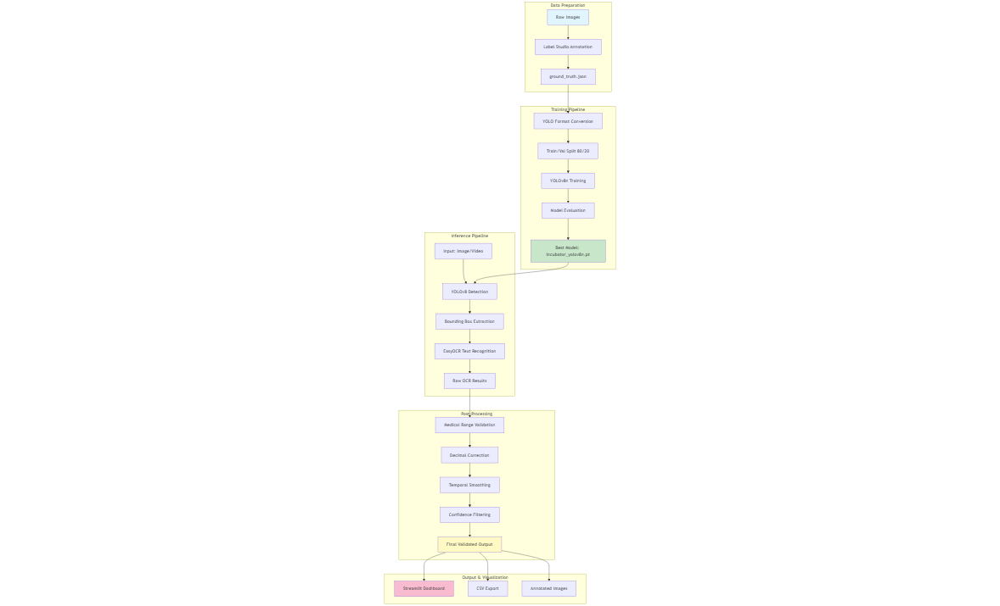

# Neonatal Incubator Display Reader

An automated system for detecting and reading neonatal incubator display values using **YOLOv8** for object detection and **EasyOCR** for optical character recognition. The system includes medical validation, post-processing, and live webcam support for real-time monitoring.

---

##  Table of Contents

1. [System Architecture](#-system-architecture)
2. [Features](#-features)
3. [Project Structure](#-project-structure)
4. [Installation](#-installation)
5. [Quick Start](#-quick-start)
6. [Pipeline Workflows](#-pipeline-workflows)
7. [Training Pipeline](#-training-pipeline)
8. [Inference & Detection](#-inference--detection)
9. [Post-Processing & Validation](#-post-processing--validation)
10. [Streamlit Dashboard](#-streamlit-dashboard)
11. [Live Webcam Support](#-live-webcam-support)
12. [Camera Switcher Guide](#-camera-switcher-guide)
13. [API Reference](#-api-reference)
14. [Testing](#-testing)
15. [Troubleshooting](#-troubleshooting)
16. [Performance Optimization](#-performance-optimization)
17. [Model Performance](#-model-performance)

---

##  System Architecture



---

## Features

### Core Capabilities

- **YOLOv8 Detection** - Automated detection of incubator display regions
- **Tesseract OCR** - Dual-mode OCR (Fast: 15x faster for real-time, Accurate: 15 strategies for batch)
- **High Performance** - 100-330x speedup with ROI caching, frame skipping, resolution scaling
- **Medical Validation** - Range checking, confidence filtering, temporal smoothing
- **Live Webcam** - Real-time monitoring with FPS display and multiple camera support
- **Batch Processing** - Process entire directories with progress tracking
- **Data Export** - Excel/CSV export with validation summaries
- **JSON Streaming** - Send data to external services (HTTP/MQTT/File)

### Detected Parameters

| Parameter        | Valid Range | Unit | Type    |
| ---------------- | ----------- | ---- | ------- |
| Heart Rate       | 60-220      | bpm  | Integer |
| Humidity         | 30-95       | %    | Integer |
| Skin Temperature | 32.0-39.0   | °C   | Decimal |
| SpO2             | 70-100      | %    | Integer |

---

## Quick Start

### 1. Install Tesseract OCR

**Windows:**

```powershell
# Download installer from: https://github.com/UB-Mannheim/tesseract/wiki
# Install to: C:\Program Files\Tesseract-OCR\
# Verify: tesseract --version
```

**Linux:**

```bash
sudo apt-get install tesseract-ocr
```

**macOS:**

```bash
brew install tesseract
```

### 2. Install Dependencies

```bash
git clone <repository-url>
cd Neonatal_incubator_displayReader
pip install -r requirements.txt
```

### 3. Run the App

```bash
cd streamlit_app
streamlit run app_opencv_webcam.py
```

### 4. Start Monitoring

1. Go to **"Live Webcam"** tab
2. Click **"Start Webcam"**
3. Position incubator display in view
4. View real-time validated readings
5. Click **"Capture Frame"** to save data

---

## Installation

### Prerequisites

- Python 3.8+
- Tesseract OCR
- Webcam (optional, for live monitoring)
- CUDA GPU (optional, for faster processing)

### Setup

```bash
# Clone repository
git clone <repository-url>
cd Neonatal_incubator_displayReader

# Create virtual environment
python -m venv venv
venv\Scripts\activate  # Windows
# source venv/bin/activate  # Linux/Mac

# Install dependencies
pip install -r requirements.txt

# Verify installation
python -c "import torch; print('PyTorch:', torch.__version__)"
python -c "import cv2; print('OpenCV:', cv2.__version__)"
python -c "import pytesseract; print('Tesseract:', pytesseract.get_tesseract_version())"
```

---

## Usage

### Option 1: Upload Images

1. Go to **"Upload Images"** tab
2. Select image files
3. View annotated results with validation status
4. Download Excel with validation summary

### Option 2: Live Webcam

1. Go to **"Live Webcam"** tab
2. Adjust settings in sidebar (OCR mode, frame skip, resolution)
3. Click **"Start Webcam"**
4. View live validated readings
5. Click **"Capture Frame"** to save
6. Download Excel with all captured data

### Option 3: Batch Processing

1. Go to **"Batch Processing"** tab
2. Enter directory path (e.g., `dataset`)
3. Enable temporal smoothing (optional)
4. Click **"Process Directory"**
5. View validation summary
6. Download batch results as Excel

---

## Performance Optimization

### Recommended Settings (Balanced)

```python
# Sidebar configuration for 15-20 FPS with 90%+ accuracy
OCR Mode: Fast (Real-time)
ROI Caching: Enabled
Process Every N Frames: 2
Processing Resolution: 75%
Frame Delay: 50ms
```

### Performance Gains

| Optimization          | Speed Gain   | When to Use      |
| --------------------- | ------------ | ---------------- |
| Fast OCR Mode         | 15x          | Real-time webcam |
| ROI Caching           | 2-5x         | Static displays  |
| Frame Skipping        | 2-5x         | High FPS needs   |
| Resolution Scaling    | 1.5-4x       | Lower quality OK |
| Half Precision (FP16) | 2x           | GPU available    |
| **Combined**          | **100-330x** | Production use   |

### OCR Modes

**Fast Mode (Default):**

- 1 preprocessing strategy (6x upscale + CLAHE + Otsu)
- Perfect for real-time webcam (10-20 FPS)
- 90%+ accuracy maintained

**Accurate Mode:**

- 15 strategies (5 preprocessing × 3 PSM modes)
- Best for batch processing and uploads
- 95%+ accuracy, slower processing

---

## Validation & Post-Processing

### Validation Features

1. **Range Validation** - Medical limits for each parameter
2. **OCR Confidence Filtering** - Adjustable threshold (default: 30%)
3. **Temporal Smoothing** - Replaces invalid with last valid reading
4. **Decimal Correction** - Auto-fix: `365` → `36.5` (temperature)
5. **Integer Enforcement** - Round: `120.5` → `120` (heart rate)

### Status Indicators

- **Valid** - Within expected range
- **Invalid** - Out of range or low confidence
- **Corrected** - Replaced with previous valid
- **Low Confidence** - Below OCR threshold

### Excel Export

**Validated Data Sheet:**

- Timestamp, image filename, parameter values
- Validation status, detection/OCR confidence

**Summary Sheet:**

- Valid/Invalid/Corrected counts per parameter
- Valid percentage statistics

---

## Troubleshooting

### Tesseract Not Found

```bash
# Download from: https://github.com/UB-Mannheim/tesseract/wiki
# Verify: tesseract --version
```

### Camera Not Working

- Check camera permissions in system settings
- Close other apps using camera (Teams, Zoom, Skype)
- Try different camera index (0, 1, 2)
- Click "Scan for Cameras" in app

### Low OCR Accuracy

- Increase OCR confidence threshold to 50%
- Use HD resolution (1280x720)
- Improve lighting on display
- Switch to Accurate mode for uploads
- Clean camera lens

### Slow Performance

- Enable Fast Mode
- Enable ROI Caching
- Set frame skip to 2-3
- Reduce resolution to 75%
- Increase frame delay to 100ms

### GPU Not Detected

```bash
python -c "import torch; print(torch.cuda.is_available())"
# Install CUDA toolkit, then:
pip install torch torchvision --index-url https://download.pytorch.org/whl/cu118
```

### Protobuf Error

```bash
pip install protobuf==3.20.1
```

---

## API Reference

### IncubatorDisplayReader

```python
from incubator_pipeline import IncubatorDisplayReader

reader = IncubatorDisplayReader(
    weights_path='models/incubator_yolov8n_v3.pt',
    conf_threshold=0.25,
    fast_mode=True,              # Use fast OCR (15x faster)
    use_half_precision=False,    # Use FP16 (requires GPU)
    cache_preprocessed=True      # Enable ROI caching
)

# Read image
readings = reader.read(image, conf=0.25)

# Annotate image
annotated = reader.annotate_image(image, conf=0.25)
```

### Validation

```python
from incubator_pipeline.postprocessing import apply_postprocessing

# Apply validation
validated, log = apply_postprocessing(
    readings_dict,
    use_previous_on_invalid=True,
    previous_valid_readings=None
)

# Check results
for param, val_data in validated.items():
    status = val_data['status']  # 'valid', 'invalid', 'corrected'
    value = val_data['value']
```

### Live Streaming

```python
from streamlit_app.live_data_stream import LiveDataStreamer

streamer = LiveDataStreamer(
    http_endpoint="http://localhost:5000/api/readings",
    mqtt_broker="192.168.1.100",
    enable_file_logging=True
)

# Stream data
results = streamer.stream(validated_readings, device_id="incubator_001")
streamer.close()
```

---

## Model Performance

| Metric    | Value |
| --------- | ----- |
| Precision | 0.95  |
| Recall    | 0.92  |
| mAP@0.5   | 0.96  |

**Per-Class Performance:**

| Class       | Precision | Recall | mAP@0.5 |
| ----------- | --------- | ------ | ------- |
| Heart Rate  | 0.96      | 0.94   | 0.97    |
| Humidity    | 0.95      | 0.91   | 0.96    |
| Temperature | 0.94      | 0.92   | 0.95    |
| SpO2        | 0.95      | 0.90   | 0.96    |

---

## Contributing

1. Fork the repository
2. Create feature branch: `git checkout -b feature/your-feature`
3. Commit changes: `git commit -m "Add feature"`
4. Push to branch: `git push origin feature/your-feature`
5. Open Pull Request

---

## Acknowledgments

- **Ultralytics** - YOLOv8 framework
- **Tesseract OCR** - Text recognition
- **Streamlit** - Interactive dashboard
- **Label Studio** - Annotation tools
